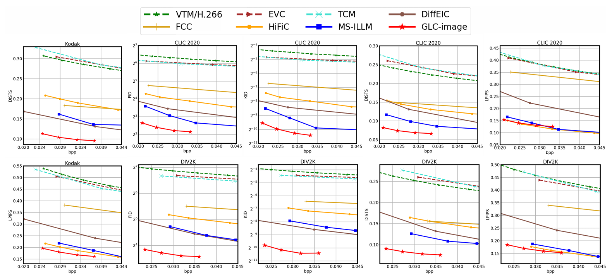
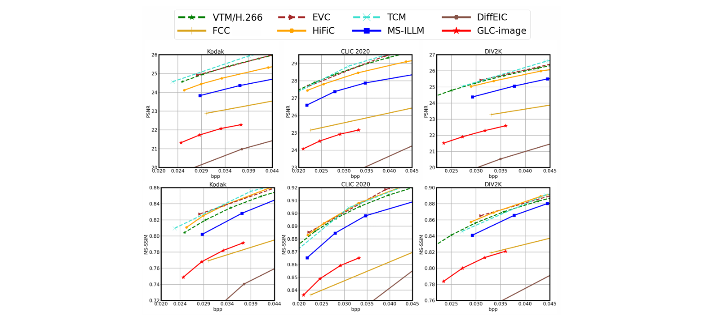

<div align="center">

# Generative Latent Coding for Ultra-Low Bitrate Image Compression

</div>

[](https://openaccess.thecvf.com/content/CVPR2024/papers/Jia_Generative_Latent_Coding_for_Ultra-Low_Bitrate_Image_Compression_CVPR_2024_paper.pdf)
[](https://ieeexplore.ieee.org/document/11007732)


Official Implementation of GLC, Generative Latent Coding for Ultra-Low Bitrate Image Compression, accepted at CVPR 2024, with an extension to video compression in TCSVT.

## Introduction

Most existing approaches for image and video compression perform transform coding in the pixel space to reduce redundancy. However, due to the misalignment between the pixel space distortion and human perception, such schemes often face the difficulties in achieving both high-realism and high-fidelity at ultra-low bitrate. To solve this problem, we propose Generative Latent Coding (GLC) models for image and video compression, termed GLC-image and GLC-Video. The transform coding of GLC is conducted in the latent space of a generative vector quantized variational auto-encoder (VQ-VAE). Compared to the pixel-space, such a latent space offers greater sparsity, richer semantics and better alignment with human perception, and show its advantages in achieving high-realism and high-fidelity compression. To further enhance performance, we improve the hyper prior by introducing a spatial categorical hyper module in GLC-image and a spatio-temporal categorical hyper module in GLC-video. Additionally, the code-prediction-based loss function is proposed to enhance the semantic consistency. Experiments demonstrate that our scheme shows high visual quality at ultra low bitrate for both image and video compression. For image compression, GLC-image achieves an impressive bitrate of less than 0.04 bpp, achieving the same FID as previous SOTA model MS-ILLM while using 45% fewer bitrate on the CLIC 2020 test set. For video compression, GLC-video achieves 65.3% bitrate saving over PLVC in terms of DISTS.


## Compression Performance

Visual comparison :


RD-Curves on image compression : 



RD-Curves on video compression : 



Please refer to the paper for more details.


## :hammer: Test Pretrained Models

Prepare the conda environment:

```bash
conda create -n glc python=3.12
conda activate glc
pip install torch==2.5.1 torchvision==0.20.1 torchaudio==2.5.1 --index-url https://download.pytorch.org/whl/cu124
pip install -r requirements.txt
```

Download the pretrained weights in the release page, config the paths correctly and run,

```bash
# test image compression
bash test_image.sh

# test video compression
bash test_video.sh
```


## :page_facing_up: Citation
If you find this work useful for your research, please cite:
```
@inproceedings{jia2024generative,
  title={Generative latent coding for ultra-low bitrate image compression},
  author={Jia, Zhaoyang and Li, Jiahao and Li, Bin and Li, Houqiang and Lu, Yan},
  booktitle={Proceedings of the IEEE/CVF Conference on Computer Vision and Pattern Recognition},
  pages={26088--26098},
  year={2024}
}
@article{qi2025generative,
  title={Generative latent coding for ultra-low bitrate image and video compression},
  author={Qi, Linfeng and Jia, Zhaoyang and Li, Jiahao and Li, Bin and Li, Houqiang and Lu, Yan},
  journal={IEEE Transactions on Circuits and Systems for Video Technology},
  year={2025},
  publisher={IEEE}
}
```


## Acknowledgement

The main implementation of GLC is based on [DCVC](https://github.com/InterDigitalInc/CompressAI), the code prediction part is based on [CodeFormer](https://github.com/sczhou/CodeFormer) and the metric evaluation part of image is based on [NeuralCompression](https://github.com/facebookresearch/NeuralCompression).
